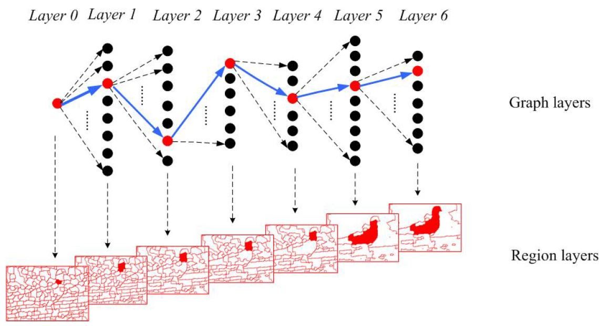
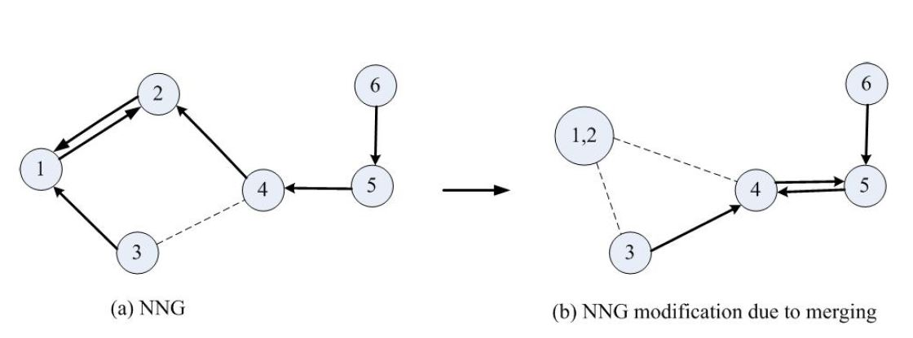

<h1 align="center">Automatic Image Segmentation by Dynamic Region Merging</h1>
<h4 align="center">Project ID: 5 | Team Noisy Pixel</h4>

 

__Shubham Dokania__ (2020701016)  
__Sai Amrit Patnaik__ (2020701026)  
__Shanthika Naik__ (2020701013)  
__Sarthak Tripathi__ (2020701027)  

Github Link: https://github.com/Digital-Image-Processing-IIITH/project-noisypixel

## Problem Statement

Image segmentation is considered to be a fundamental yet challenging problem in the domain of Computer Vision and Image Processing, owing to it's importance for tasks such as object recognition, tracking, image retrieval, medical image processing etc. The goal of image segmentation is to group partitions of an image into different categories which form meaningful information and contribute to both visual and computational information.

A vast amount of research on this topic encompasses approaches including but not limited to edge detection based methods to get boundaries and segment the components. However, since the edges are often discontinuous or over-detected, they can only provide a candidate for the object boundaries. In this project, we formulate the image as a graph and solve a combinatorial optimization problem to obtain the segmented parts. Specifically, we try to divide an image into a region-based graph and apply dynamic merging over these regions to group regions from the same objects under the same label.

*__Figure__ : An example of the segmentation process. We see that the first image depicts the input RGB data in which we want to apply segmentation. The second figure (middle) shows the initial over-segmented state of the input image, and the final visualization shows the result of Dynamic Region Merging Algorithm on the image. The final image shows the different labels being well separated into different groups/partitions.*

## Goals and Approach

The goal of this projects is to automate the process of image segmentation by taking a region merging approach, and to implement efficient methods to speed-up the region merging process. We follow the work of _Peng et. al._ [1] for our implementation and demonstrate the effectiveness of the proposed method through various sets of images, and extend their work to the task of satellite imagery, which is generally considered a challenging task.

For the implementation, we start with an initially over-segmented image with many regions, which is represented as a graph. We then iteratively want to merge regions based on some statistical properties of the regions. We formulate the problem as an objective function which we then solve using the method of Dynamic Programming, and further proceed to improve the algorithm performance by modifying the graph structure.

The process for the implementation can be broken down into the following parts:
1. Region Merging Predicate
2. Dynamic Region Merging
3. Nearest Neighbour Graph Approach

### Region Merging Predicate

Two regions in a graph are merged if:  
 - they are the most similar neighbours in each other’s neighbourhood.
 - they are consistent (also considered as the stopping criterion for the merging process).

#### Dissimilarity:
The dissimilarity between two regions $R_1,R_2$ are given by the minimum of weight $w$ of all the edges $E$ between the set of pixels $v_i \in V$ of the two regions.
$$ S(R_1,R_2) = min_{v_i \in R_1,v_j \in R_2,(v_i,v_j) \in E} w((v_i,v_j))$$

The two regions in the neighborhood are said to be most similar if:
$$ S(R_1,R_2) = min_{R_i \in \Omega_1} S(R_1,R_i) = min_{R_j \in \Omega_2} S(R_2,R_j)$$
where $\Omega_1$ and $\Omega_2$ are the neighborhood sets of $R_1$ and $R_2$

#### Consistency
The consistency between the two regions is given by SPRT (Sequential Probability Ratio Test) [2]. First, the distribution of visual cues $P_0(x|\theta_0) , P_1(x|\theta_1)$ between two regions is obtained using the Gaussian distribution model.

Then, the likelihood ratio $\delta_i$ is given by:
$$\delta_i = \log \frac{P_0(x_i|\theta_0)}{P_1(x_i|\theta_1)}, i=1,2,...,N$$

where $N$ is the number of tests. The overall likelihood $\delta$ is obtained by summing over the $\delta_i$.

If the delta exceeds the bounds or the number of tests are made, this $\delta$ value is used to predict the consistency between two regions.

### Dynamic Region Merging

Region merging starts from an over-segmented image. Once the initial labels are obtained, the labels are updated every pass and a final label $l_i^n$ is obtained. We get a sequence of labels $(l_i^1, … , l_i^n)$ and multiple such sequence of labels are obtained because of the uncertainty in the SPRT. The optimal sequence is obtained by minimising the objective function F which is defined as the measure of transition costs in the space of partitions. F is the sum of transition costs over all regions, then,
$$F = \sum_{R_i} F_i$$
The solution is found using a DP approach as,
\begin{equation}
\begin{aligned}
\text{min} F_i (l_i^0 , ... , l_i^n ) & =  \text{min}F_i (l_i^0 , l_i^{n − 1} ) + d_{n− 1, n}\\
                                      & =  \text{min} F_i (l_i^0 , l_i^{n−2} ) + d_{n− 2,n − 1} + d_{n − 1, n}\\
                                      & =  \text{...}\\
                                      & = \sum_{k=0}^{n-1} d_{k,k+1}
\end{aligned}
\end{equation}

From an earlier assumption, we conclude that,
$$d_{k ,k +1} = \min_{R_{k+1} \epsilon \Omega_k} S ( R_k , R_{k +1} )$$

The overall path length from $l_i^0$ to $l_i^n$ is the sum of minimum edges $d_{k,k+1}$ for each node in that path. This problem reduces to a search for a shortest path problem, whose solution can be found at a finite set of steps by the Dijkstra’s algorithm in polynomial time.

*__Figure__ : The dynamic region merging process as a shortest path in a layered graph. The upper row shows the label transitions of a graph node. The lower row shows the corresponding image regions of each label layer. Starting from layer 0, the highlighted region (in red) obtains a new label from its closest neighbor (in red). If the region is merged with its neighbor, they will be assigned to the same label. The shortest path is shown as the group of the directed edges (in blue).*

### Nearest Neighbour Graph based Accelaration

The Dynamic Region Merging process depends on the adjacency relationship between two regions, and following the steps based on the previous points, we notice that at each merging step, an edge with a minimum weight in a certain neighbourhood is required. A linear search for such an edge takes $O(\|E\|)$ time, which in turn makes the overall process highly computation intensive.

Based on the observation that only a small portion of RAG edges counts for the merging process, we can find an algorithm for accelerating the region merging. For a given RAG, where $G = <V, E>$, the Nearest Neighbour Graph (NGG) is defined as a directed graph $G_m = <V_m, E_m>$, with $V_m = V$. We then define a symmetric dissimilarity function $S$ to measure the edge weights, where the directed edge set $E_m$ is defined as:

$$
E_m = \{ (v_i, v_j) | w((v_i, v_j)) = min_k S(v_i, v_k), (v_i, v_k) \in E \}
$$

Based on the above formulation, we notice that the out-degree of each node is exactly one, and $\|E_m\| = \|V_m\|$ in the resulting NGG. So, for the graph we end up having cycles of length two for the compponents that satisfy the stopping criterion which we established with the region merging predicate $P$. This way, we can consider the algorithm to stop when the number of cycles becomes zero in the NNG.

*__Figure__ : The image shows an example of how the modification appears in a Nearest Neighbour Graph derived from a RAG. We notice that the new cycle is generate between node 4 and node 5, which are in the second order neighbourhood of the nodes (1,2) which were merged together in the Dynamic Region Merging process.*

The justification for this formulation is that, only using RAG requires $O(\|V\|)$ searching time for merging in each step. But in the NNG methods, after the nodes of the cycle are merged, the weights of RAG and the structure of NNG can be modified. There is also an observation that the new cycle can only form in the second-order neighbourhood of the merged nodes (as is also shown in the figure above). This way, the computation time for a merge of the NNG cycle is $O(\gamma^{(2)} + 1)$, where $\gamma^{(2)}$ is the size of the second order neighbourhood, which is significantly smaller than $\|V\|$. Hence, it can be shown that the number of computations will be significantly reduced by following this strategy.

## Dataset

We plan to use the Berkeley Segmentation Dataset [3] for the given task. The dataset consists of 300 images (grayscale and color) and their corresponding segmentations, where the dataset is further divided into training set of 200 images and testing set of 100 images. Furthermore, we wish to demonstrate the effectiveness of this method on the task of segmentation over satellite image data samples as part of the demo.

## Expected Deliverables

From the implementation of the project, the expected deliverables are:

- A working method of automatic image segmentation for any given image, considering the limitaitons of the algorithm and it's accuracy.
- An efficient implementation of the NNG method for improving performance of the Automatic Image Segmentation algorithm as proposed in the paper.
- A Demo of the Dynamic Region Merging technique and affect of the parameters $(\lambda_1, \lambda_2, \textit{etc.})$ on the output of the algorithm.
- If feasible in the time constraints, running the method on examples of satellite imagery to extract useful information (buildings, roads, vegetation etc.)
- Presentation and description of the project along with instructions to run the demo.

## Milestones & Timeline

| Timeline                    | Milestones                                                                   |
|-----------------------------|------------------------------------------------------------------------------|
| 12 October 2020             | Project Allocation                                                           |
| 18 October 2020, 11:55 PM   | Project proposal submission                                                  |
| Week 1                      | Paper and relevant work reading,  discussions and initial project layout  |
| Week 2                      | Implementation of core algorithm  with TA reviews                         |
| 31 October 2020             | Mid Evaluation                                                               |
| Week 3                      | Implementation of NNG method and  results compilation on dataset          |
| Week 4                      | Running the method on proposed  application and presentation preparation  |
| Week 4+                     | Finishing steps and Submission                                               |
| 19-25 November 2020         | Final Evaluation                                                             |

## References

1. Peng, B., Zhang, L. and Zhang, D., 2011. Automatic image segmentation by dynamic region merging. _IEEE Transactions on image processing_, 20(12), pp.3592-3605.

2. A. Wald. Sequential Analysis. _Wiley Publications in Statistics_, Third ed. Wiley, 1947.

3. D. Martin, C. Fowlkes, D. Tal, & J. Malik (2001). A Database of Human Segmented Natural Images and its Application to Evaluating Segmentation Algorithms and Measuring Ecological Statistics. In Proc. 8th Int'l Conf. Computer Vision (pp. 416–423).